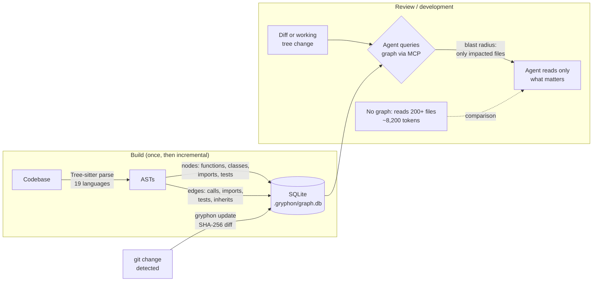

# gryphon

> A local code knowledge graph that gives AI coding tools precise review context over MCP.

> [!NOTE]
> **This is a fork of [tirth8205/code-review-graph](https://github.com/tirth8205/code-review-graph)** by Tirth Kanani, released under MIT.
> The upstream project is the origin of the parser, graph store and MCP server; this fork renames the
> package and adds its own changes on top. See [Relationship to upstream](#relationship-to-upstream).

AI coding tools often re-read large parts of a codebase to review a change. `gryphon` builds a structural map of the code with [Tree-sitter](https://tree-sitter.github.io/tree-sitter/), keeps it updated incrementally, and serves compact context over [MCP](https://modelcontextprotocol.io/), so the assistant reads only the files a change touches.

## Quick Start

This fork is **not published on PyPI** — `pip install gryphon` installs an unrelated package. Install from Git:

```bash
pip install git+https://github.com/jjgouveia/gryphon-standalone.git
gryphon install              # detect installed AI coding tools and configure each one
gryphon build                # parse the codebase
```

`install` detects which AI coding tools you have, writes an MCP server entry for each, installs hooks and skills where the platform supports them, and adds graph instructions to the platform's rules file. The MCP entry launches `gryphon serve` with the same Python interpreter that ran `install` (`python -m gryphon serve`); when `install` itself runs inside an ephemeral `uvx` environment, it writes `uvx --from <dist> gryphon serve` instead. Restart the editor or tool afterwards.

To configure one platform, pass `--platform` with one of `codex`, `claude-code`, `cursor`, `windsurf`, `zed`, `continue`, `opencode`, `antigravity`, `gemini-cli`, `qwen`, `kiro`, `qoder`, `copilot`, `copilot-cli`, `codebuddy`, or `hermes`:

```bash
gryphon install --platform cursor
gryphon install --platform codebuddy
```

Requires Python 3.10+.

## Auto-Bootstrap on a Mid-to-Large Project

Check whether `gryphon` is installed (`Get-Command gryphon` / `which gryphon`) and whether `.gryphon/` exists in the workspace. If it's installed but not built, run `gryphon build` before reading multi-file contexts. If it's not installed and the project is large, offer to install it (`pip install git+https://github.com/jjgouveia/gryphon-standalone.git`) and build it — worth ~8x token savings here.

**If not installed and the user declines:** fall back to manual review with plain git/pytest — scope the diff with `gh pr diff`, read the base with `git show origin/<base>:<path>`, grep for call sites, run the affected test scope.

## When to Use vs When to Skip

### Use it if:
- Codebase is **500+ files**
- You make **multi-file changes** with cross-module dependencies
- You spend **$20+/month** on AI assistant tokens
- You work with **monorepos**, microservices, or cross-package TypeScript
- You want **better review quality** in addition to cost savings

### Skip it if:
- Codebase is **under ~200 files** with isolated single-file changes
- Heavy use of **dynamic patterns** (reflection, runtime code gen, dynamic imports)
- You want **zero-maintenance** — the graph needs to stay in sync
- Team hasn't standardized on an AI coding tool yet

### Evaluate first if:
- Codebase is **200–500 files** — benchmark before committing
- Mix of **static and dynamic patterns** — test on representative commits

## How It Works



Four layers: **parse** (Tree-sitter → ASTs), **store** (nodes and edges in local SQLite), **trace** (BFS computes the blast radius of a change), **serve** (MCP exposes the graph to the assistant). The graph never contains source code, only structural metadata.

### What the Graph Contains
- **Nodes:** Files, functions, methods, classes, imports, tests
- **Edges:** "A calls B", "X imports Y", "TestZ covers FunctionW", "ClassA extends ClassB"
- **Metadata:** Name, type, file path, line range per node
- **Privacy:** Structural metadata only — NO source code content in the graph

### Supported Languages (19)
Python, TypeScript, JavaScript, Go, Rust, Java, C#, Ruby, Kotlin, Swift, PHP, C/C++, Vue SFC, Solidity, Dart, R, Perl, Lua, Jupyter/Databricks notebooks.

## Token Impact

| Codebase Type | Without Graph | With Graph | Reduction |
|---------------|---------------|------------|-----------|
| FastAPI (3K files) | 138,585 tokens | 37,217 tokens | **3.7x** |
| httpx | 64,666 tokens | 14,090 tokens | **4.6x** |
| Next.js monorepo (27K files) | 739,352 tokens | 15,049 tokens | **49.1x** |
| Express.js (small) | Less benefit | Graph overhead > savings | **~1x** |
| **Average across 6 repos** | — | — | **8.2x** |

> **Quality also improves:** Graph-assisted reviews score **8.8/10** vs **7.2/10** for naive reviews. Less noise = better signal = more accurate output.

## Core Workflows

### 1. Blast Radius Analysis (Primary Use)

This is automatic when the MCP server is active. Your AI assistant queries the graph before reading files, getting only the impacted files instead of everything.

```
Without graph:  Changed auth/middleware.py → AI reads 200+ files → 8,200 tokens
With graph:     Changed auth/middleware.py → Graph returns 12 impacted files → 1,000 tokens
```

### 2. Risk-Scored Change Analysis

```bash
gryphon detect-changes
```

Scores each uncommitted change by risk level:
- Number of dependents
- Test coverage gaps
- Whether changed functions are on critical paths
- High-risk changes flagged **before** you ask for review

### 3. Dead Code Detection

The graph finds nodes with **no incoming edges** — no callers, no importers, no test coverage:

```bash
# Surfaces functions/classes that are candidates for removal
# Useful on mature codebases to reduce cruft
```

### 4. Refactoring Preview

```bash
gryphon rename preview --from OldClassName --to NewClassName
```

Shows every file affected by a rename, and flags edge cases (dynamic string references that static analysis can't catch).

### 5. Architecture Visualization

```bash
gryphon visualize
```

Generates interactive visualization showing module clusters using community detection (Leiden algorithm). Useful for:
- Onboarding new contributors
- Identifying architectural drift
- Spotting overly-coupled modules

### 6. Wiki Generation

```bash
gryphon wiki
```

Generates markdown wiki of codebase structure — every module, its public API, dependencies, and test coverage.

### 7. Semantic Search (optional, needs `[embeddings]`)

```bash
gryphon embed   # one-time, cached
```

Enables `semantic_search_nodes_tool` — search entities by concept ("rate limiting middleware") instead of exact name.

## MCP Tools

| Tool | Purpose |
|------|---------|
| `build_or_update_graph_tool` | Build or incrementally update the graph |
| `get_minimal_context_tool` | Ultra-compact context (~100 tokens). Always call first. |
| `get_impact_radius_tool` | Files/functions affected by a change |
| `get_review_context_tool` | Token-optimised structural summary for review (~156–207 tokens) |
| `detect_changes_tool` | Risk-scored change analysis |
| `query_graph_tool` | Callers, callees, tests, imports, inheritance |
| `semantic_search_nodes_tool` | Search entities by name or meaning (needs embeddings) |
| `get_architecture_overview_tool` | High-level codebase structure |
| `get_affected_flows_tool` | Which execution paths are impacted |
| `find_large_functions_tool` | Functions/classes over a line-count threshold |
| `refactor_tool` | Rename preview, dead code, suggestions |
| `list_graph_stats_tool` | Graph size and health statistics |

## CLI Reference

```bash
gryphon install     # register MCP server with the client
gryphon build       # full parse (first run)
gryphon update      # re-parse only changed files
gryphon status      # node/edge counts, language breakdown, last update
gryphon watch       # continuous incremental updates on file save
gryphon visualize   # interactive D3.js graph in the browser
gryphon serve       # start the MCP server manually (clients do this automatically)
gryphon embed       # compute vector embeddings (needs [embeddings] extra)
gryphon detect-changes  # risk-score uncommitted changes
gryphon wiki        # markdown wiki of modules, APIs, coverage
gryphon register /path/to/repo   # multi-repo setup
gryphon repos       # list registered repos
```

## Token Savings Dashboard

Gryphon measures how many tokens the graph saves you — per tool call and per diff — and accumulates it in a JSONL log.

### Where the numbers come from

Every tool response that carries a `context_savings` estimate (`get_impact_radius_tool`, `get_review_context_tool`, `detect_changes_tool`, `get_architecture_overview_tool`) is appended automatically to `.gryphon/savings.jsonl` in the repo and to the global `~/.gryphon/savings.jsonl`. Entries are labelled `kind="tool_call"`.

For a concrete diff, measure directly — baseline is the token cost of reading every changed file **plus** every impacted file the graph surfaces; the graph cost is the compact response the agent consumes instead:

```bash
gryphon measure --base 3300d1b1 --head origin/feature-branch --ref "PR #197"
gryphon measure --files src/a.py src/b.py
gryphon savings --repo /path/to/repo   # CLI summary
```

### Dashboard

```bash
gryphon savings --serve            # http://127.0.0.1:8765
```

Self-contained stdlib server (no extra dependencies): total saved, savings per day, per-repo and per-tool breakdowns, entry history, and a form to measure a `base...head` diff on demand.

> Numbers are labelled `estimated` — the counter is a conservative ~4-chars-per-token approximation. Install `tiktoken` (`pip install tiktoken`) and measurements switch to the real `cl100k_base` tokenizer (`verified: true` in measure output).

## Configuration

### Ignore File

Create `.gryphonignore` at project root (uses `.gitignore` syntax):

```
# Build artifacts
dist/**
.next/**
build/**

# Dependencies
node_modules/**
vendor/**

# Generated files
generated/**
*.generated.ts
*.min.js

# Test fixtures (if large)
__fixtures__/**
```

> Excluding generated files and build artifacts is critical — they inflate the graph with meaningless nodes.

### Multi-Repo Setup

For microservice architectures:

```bash
# Register additional repos
gryphon register /path/to/other/repo

# List all registered repos
gryphon repos
```

The MCP server serves context across all registered repositories.

### Where the Graph Is Stored

Local SQLite at `.gryphon/graph.db` — no external database, nothing leaves the machine. Add to `.gitignore` if you don't want it committed:

```bash
echo ".gryphon/" >> .gitignore
```

Or commit it to share the pre-built graph with the team (saves the initial build per developer).

## Known Limitations

| Limitation | Impact | Mitigation |
|-----------|--------|------------|
| **Dynamic imports** (`require(variable)`, `import(buildPath())`) | Dependencies invisible to parser | Manually note in `.gryphonignore` or accept over-prediction |
| **Reflection-based calls** (Django signals, `getattr()`, Java reflection) | Missed edges in graph | Combine with grep manual for these patterns |
| **Runtime-generated code** (`eval`, template engines) | Not parseable at static time | Accept limitation or exclude from graph |
| **Cross-language boundaries** (Python calling TypeScript API) | No edges between language runtimes | Use multi-repo registration as partial workaround |
| **Stale graph** (without watch mode) | Claude queries outdated relationships | Always run `gryphon update` before tasks, or use watch mode |
| **TypeScript path aliases** (`@/components/...`) | May require tsconfig resolution config | Check `tsconfig_resolver.py` handles your setup |

## Troubleshooting

| Symptom | Fix |
|---|---|
| Graph stale / missing recent changes | `gryphon update`; if still off, `gryphon build` (full rebuild) |
| MCP server not connecting | `gryphon install` to re-register; restart the client |
| `uv` not found | `curl -LsSf https://astral.sh/uv/install.sh \| sh` or `pip install uv` |
| Semantic search not working | `pip install "gryphon[embeddings] @ git+https://github.com/jjgouveia/gryphon-standalone.git"` then `gryphon embed` once |
| Language not parsed | Check extension in `EXTENSION_TO_LANGUAGE`; `gryphon status` shows detected languages |
| Slow first build | Expected — Tree-sitter parses every file; subsequent `update` is <2s (SHA-256 diff) |

## Relationship to upstream

This project is a fork of **[tirth8205/code-review-graph](https://github.com/tirth8205/code-review-graph)**
by **Tirth Kanani**, licensed under MIT. The upstream project contributed the Tree-sitter parser,
the SQLite graph store, the MCP server and the bulk of the language support; this fork is not a
rewrite and does not claim that work as original.

What this fork changes:

- Renames the distribution, CLI and storage directory (`code-review-graph` → `gryphon`,
  `.code-review-graph/` → `.gryphon/`). Environment variables keep the `CRG_` prefix for
  backwards compatibility with existing setups.
- Adds context-savings measurement and a local dashboard (`gryphon savings`, `gryphon measure`).
- Performance work on the graph store, resolver passes and the post-processing pipeline.

Benchmark figures quoted in this README (FastAPI 3.7x, Next.js 49.1x and the 8.2x average) were
measured by the upstream project; they have not been re-measured for this fork.

Upstream is the place to go for the project's history and its issue tracker. Issues specific to
this fork belong here.

## License

MIT — see [LICENSE](LICENSE), which retains the original copyright
(`Copyright (c) 2026 Tirth Kanani`) as the MIT terms require.

Forked from [tirth8205/code-review-graph](https://github.com/tirth8205/code-review-graph).
